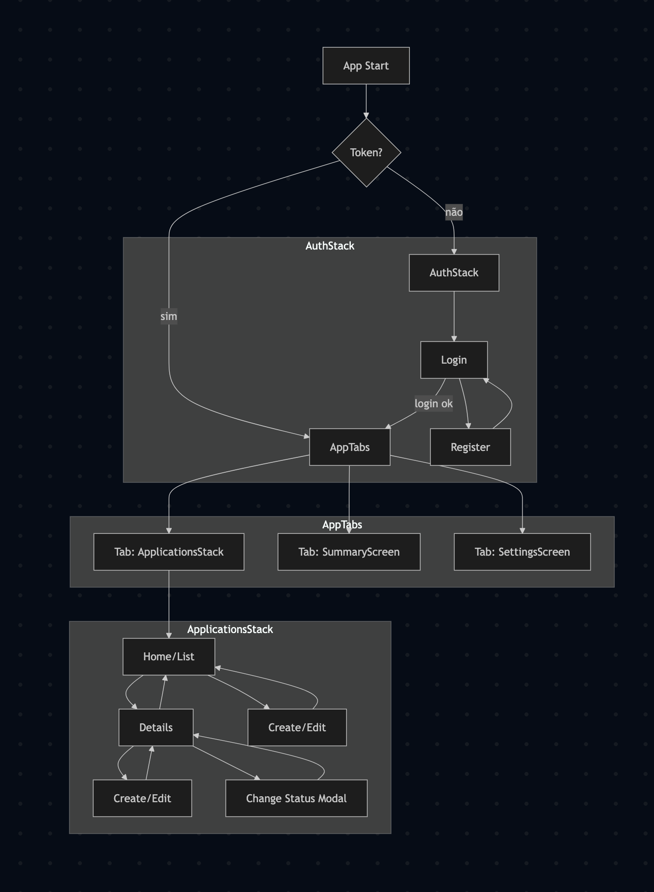
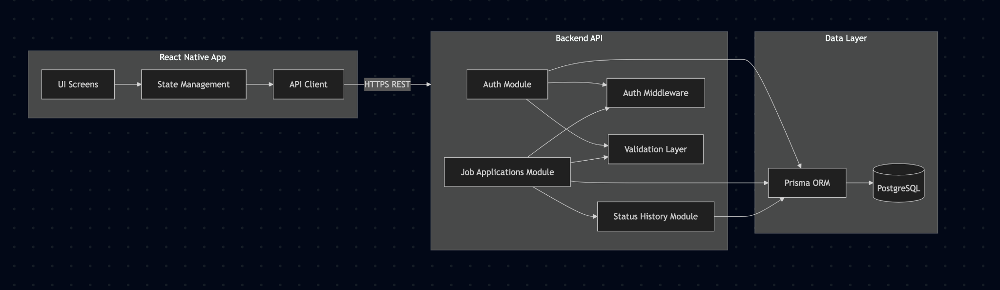

# MyJob

## Goal

<table>
  <tr>
    <td style="vertical-align: top; padding-right: 16px;">
      <ul>
        <li>Build a realistic mobile app with Expo Router and full navigation (tabs + modals + stacks)</li>
        <li>Push domain modeling beyond CRUD and keep the shape ready for a real backend</li>
        <li>Show architecture choices that scale and are easy to explain in interviews</li>
        <li>Deliver a polished UX (dark mode, bottom sheet, central CTA) with clean, composable code</li>
        <li>Leave the door open to plug in a Fastify + Prisma API without rewriting the app</li>
      </ul>
    </td>
    <td style="vertical-align: top;">
      
    </td>
  </tr>
</table>

---

## Stack

- Mobile: React Native 0.81, Expo Router 6, NativeWind (Tailwind), Reanimated, Safe Area + Screens
- State: React Context for applications and user, ready for a swap-in API client
- Backend (designed): Fastify, Prisma, PostgreSQL, JWT, Bcrypt, Zod; containerized via Docker Compose
- Tooling: TypeScript end-to-end, Expo, TSX on the backend, lint/format through the Expo ecosystem

---

## Features

- Create and manage applications with clear statuses (Applied, OA, Interview, Offer, Rejected)
- Creation bottom sheet to cut friction and keep context
- Dark mode and compact UI for quick list scanning
- Local-first persistence: works offline and is ready to sync with an API
- Direct flow: central CTA (+), short tabs, and details via push

---

## Navigation & User Flow

The app uses a tab-based navigation structure:

- Home screen with the list of applications
- Settings screen with user information
- A central action button (+) to create new applications
- Modals for creation and status changes
- Push navigation for application details

This structure was chosen to keep the app easy to use and easy to extend.



---

## Architecture Overview



- Clear layers: UI (RN + Expo Router) → Context/Services → (future) API client → Backend
- Local-first: the app runs fully offline with Context; plug in a fetcher to sync
- Deliberate navigation: tabs for daily flow, modals for create/edit, push for details
- Backend designed separately: Fastify + Prisma + PostgreSQL with JWT, ready to boot via Docker
- Security and resilience considered: rate limit, CORS, JWT refresh tokens modeled in the domain

---

## Data Model

- User → N applications with a current status and planned history
- Status change captures timestamp and reason (for analytics and automation)
- Refresh tokens modeled as an entity for session control and revocation
- Prisma schema and diagrams ready to `prisma migrate` as soon as the API goes live

Full diagram: [`docs/domain-model.png`](./docs/domain-model.png)

---

## Project Structure

```txt
app/
 ├─ (tabs)/          # Main navigation
 ├─ (modals)/        # Bottom-sheet modals
 ├─ applications/    # Application details
 └─ _layout.tsx

src/
 └─ context/
    ├─ applications.tsx
    └─ user.tsx
```

---

## How to Run (Mobile)

```bash
cd apps/app
npm install
# set EXPO_PUBLIC_API_URL for your environment:
# - iOS simulator: http://localhost:3333
# - Android emulator: http://10.0.2.2:3333
# - Physical device: http://<your-lan-ip>:3333
npx expo start
```

## How to Run (Backend)

```bash
cd apps/api
npm install
# set envs: DATABASE_URL, JWT_SECRET, etc.
npm run dev
```

## Build / Release (EAS)

```bash
cd apps/app
# ensure EXPO_PUBLIC_API_URL is set in EAS Secrets for production
eas build -p android --profile production
```

## Assets

- Icons/splash: `apps/app/assets/` (icon.png, adaptive-icon.png, splash-icon.png, favicon.png)
- Logo: `apps/app/assets/joblylogo.png`
- Diagrams/screens: `docs/architecture.png`, `docs/navigation-flow.png`, `docs/domain-model.png`
- Demo: `docs/video-demo.gif`

## Known Notes

- Dependency warnings: match Expo SDK suggestions with `npx expo install --check` if needed.\*\*\*
